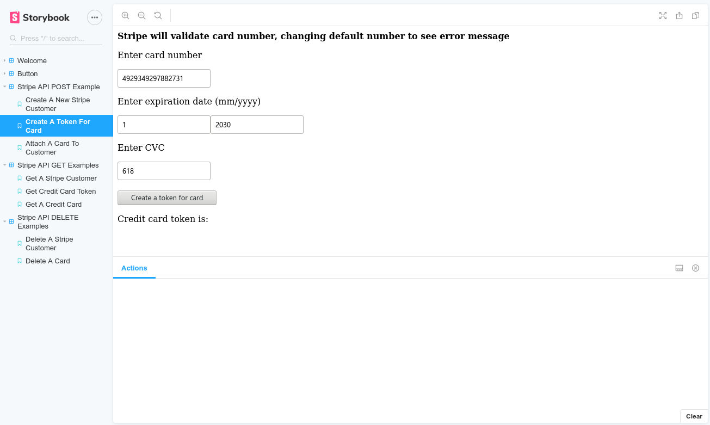

# StripeAPIComponent

[](https://github.com/Vagacoder/StripeAPIComponents/)


## Introduction

StripeAPIComponet is a package providing integerated APIs for Stripe. It does NOT use any Stripe developmental tools. 
All functionalities are implemented using Stripe RESTful [APIs](https://stripe.com/docs/api) on URL endpoints.

## Demo

This package comes with Storybook demos. To check it:

1. Clone this repository to local
2. Create a file: `StripeConfig.json` at `/src` folder including your Stripe api key, like: `{ "api_key" : "your secrect api key" }`


3. $ npm run storybook




## APIs provided by this package

### stripeAPI(params)

stripeAPI is the fundamental function of StripAPIComponent. Instead of calling stripeAPI directly, call wrappers such as `stripeGet()`, `stripePost()`.

#### params

params is a JSON object with attributes:

* endpoint

	endpoint includes: 
	
	1. create a new customer/get customer: 'customers'
	2. create a token/get token: 'tokens'
	3. balance of entire account: 'balance'
	
* method

	Standard RESTful methods: 'GET', 'POST', 'PUT', 'DELETE'.

* body

	body is another JSON object which contains data.
	
	e.g. 
	
	```newCustomer1 = {
    firstName: "Alex",
    lastName: "Smith",
    address: "1000 State Street",
    city: "Smalltown",
    state: "CA",
    country: "USA",
    zipcode: "91000",
    email: "as@small.com",
    phone: "8881230000",
    companyName: "Bloom",
    webUrl: "www.bloom.net",
    }
	```
	
* api_key

	Your Stripe api_key, default stored in src/StripeConfig.json

### stripeGet(params)

stripeGet internally call stripeAPI and passing in `method: 'Get'`

#### params

params is same as params in stripeAPI.

### stripePost(params)

stripePost internally call stripeAPI and passing in `method: 'POST'`

#### params

params is same as params in stripeAPI.

### stripeDelete(params)

stripeDelete internally call stripeAPI and passing in `method: 'DELETE'`

#### params

params is same as params in stripeAPI.

		
## Example

1. Create a new customer

	```
	const newCustomer1 = {
    firstName: "Alex",
    lastName: "Smith",
    address: "1000 State Street",
    city: "Smalltown",
    state: "CA",
    country: "USA",
    zipcode: "91000",
    email: "as@small.com",
    phone: "8881230000",
    companyName: "Bloom",
    webUrl: "www.bloom.net",
	};
	
	stripePost({
      endpoint: 'customers',
      body: props.data,
      api_key: Stripconfig.api_key,
    }).then((resp: any) => {
      console.log(resp);
      let customerId = resp.id;
      props.setCustomerId(customerId);
    }).catch(e => {
      console.log(e);
    });
	```
2. Create a token

	```
	stripePost({ endpoint: "tokens", body: body, api_key: Stripconfig.api_key })
        .then((resp: any) => {
          console.log(resp);
          let cardToken = resp.id;
          props.setCreditTokenId(cardToken);
        }).catch(e => {
          console.log(e);
        })
	```
	
3. Create a credit card (need customer Id and card token Id)

	```
	stripePost({
      endpoint: `customers/${props.data.customerId}/sources`,
      body: { cardTokenId: props.data.cardTokenId },
      api_key: Stripconfig.api_key,
    }).then((resp: any) => {
      console.log(resp);
      props.setCreditId(resp.id);
    }).catch(e => {
      console.log(e);
    })
	```
	
4. Get a customer (need  customer Id)
	
	```
	stripeGet({
      endpoint: `customers/${props.customerId}`,
      api_key: Stripconfig.api_key,
    })
      .then((res: any) => {
        console.log(res);
        setCustomerInfo(JSON.stringify(res));
      })
      .catch((e: any) => { console.log(e) });
	```

5. Get token (need token Id)

	```
	stripeGet({
      endpoint: `tokens/${props.tokenId}`,
      api_key: Stripconfig.api_key,
    })
      .then((res: any) => {
        console.log(res);
        setTokenInfo(JSON.stringify(res));
      })
      .catch((e: any) => { console.log(e) });
	```
	
6. Get credit card (need customer Id and card Id)

	```
	stripeGet({
      endpoint: `customers/${props.customerId}/sources/${props.creditCardId}`,
      api_key: Stripconfig.api_key,
    })
      .then((res: any) => {
        console.log(res);
        setCreditCardInfo(JSON.stringify(res));
      })
      .catch((e: any) => { console.log(e) });
	```
	
7. Delete a customer (need customer Id)

	```
	stripeDelete({
      endpoint: `customers/${props.customerId}`,
      api_key: Stripconfig.api_key,
    })
      .then((res: any) => {
        console.log(res);
        setCustomerInfo(JSON.stringify(res));
      })
      .catch((e: any) => { console.log(e) });
	```
	
8. Delete a credit card (need customer Id and card Id)

	```
	stripeDelete({
      endpoint: `customers/${props.customerId}/sources/${props.creditCardId}`,
      api_key: Stripconfig.api_key,
    })
      .then((res: any) => {
        console.log(res);
        setCardInfo(JSON.stringify(res));
      })
      .catch((e: any) => { console.log(e) });
	```
	
9. Get all customers

	```
	stripeGet({
      endpoint: 'customers?limit=3',
      api_key: Stripeconfig.api_key,
    }).then((res: any) => {
      console.log(res);
      setCustomers(res.data);
    })
      .catch((e: any) => { console.log(e) });
	```

10. Get all credit cards

	```
	stripeGet({
      endpoint: `customers/${props.customerId}/sources?limit=3&object=card`,
      api_key: Stripeconfig.api_key,
    }).then((res: any) => {
      console.log(res);
      setCards(res.data);
    })
      .catch((e: any) => { console.log(e) });
	```
	
11. Get account balance

	```
	stripeGet({
      endpoint: 'balance',
      api_key: Stripeconfig.api_key,
    }).then((res: any) => {
      console.log(res);
      setBalance(JSON.stringify(res));
    })
      .catch((e: any) => { console.log(e) });
	```
